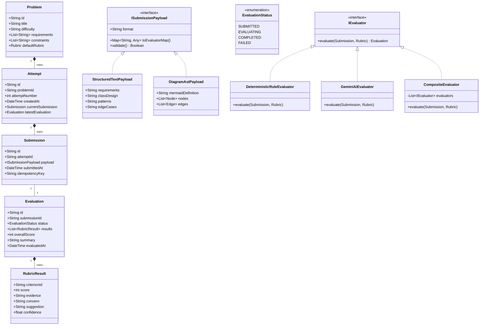
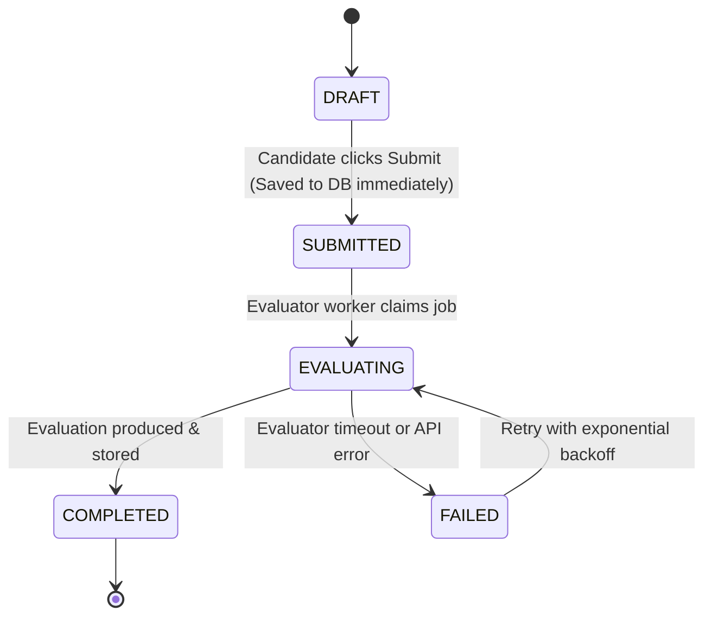

# Low-Level Design (LLD) Practice Platform — Architectural & Technical Design Document

> **Document Status**: Complete & Approved  
> **Target Audience**: Engineering Team, Hiring Committee, System Architects  
> **Author**: Antigravity Principal Systems Architect  
> **Reference Guide**: Candidate Helping Guide (LLD Practice Platform)

---

## Table of Contents
1. [Executive Summary & Problem Space](#1-the-learner-problem)
2. [Research & Competitive Analysis](#2-research--market-gaps)
3. [Narrow MVP Definition](#3-narrow-mvp-definition)
4. [Submission Model & Evidence Architecture](#4-submission-model)
5. [Rubric-Driven Evaluation Engine](#5-rubric-driven-evaluation-engine)
6. [Separation of Concerns: Deterministic vs. AI Logic](#6-deterministic-vs-ai-boundaries)
7. [Consistent & Actionable AI Feedback](#7-consistent--actionable-ai-feedback)
8. [Low-Level Domain Model (Class Design)](#8-domain-model--class-design)
9. [Two Simple Change Tests](#9-two-simple-change-tests)
   - 9.1 [Change Test A: Text to Class Diagram Payload](#91-change-test-a-text-to-class-diagram-evolution)
   - 9.2 [Change Test B: Multi-Evaluator & Human-in-the-Loop Strategy](#92-change-test-b-evaluator-engine-extensibility)
10. [Scale, Concurrency & State Machine](#10-scale-concurrency--state-machine)
11. [Architectural Trade-offs & Evolutionary Roadmap](#11-architectural-trade-offs--roadmap)

---

## 1. The Learner Problem

### 1.1 The Core Pain Points of LLD Learners
Practicing Low-Level Design (LLD) and Object-Oriented Design (OOD) presents fundamentally different challenges from practicing Data Structures and Algorithms (DSA):

1. **No Binary Output (No LeetCode Pass/Fail)**:
   In DSA, a solution either passes tests within time limits or fails. In LLD, there is no single "correct" answer. Five senior engineers can design a parking lot or ride-sharing dispatch in five radically different ways (e.g., event-driven vs. state machine vs. strategy pattern) and all five can be valid.
2. **The "Reference Solution" Fallacy**:
   When learners compare their code against an online blog or YouTube video, they often assume divergence means failure. They fail to understand *why* a particular design pattern was chosen, or whether their alternative was actually better suited for different tradeoffs.
3. **Subjective & Unactionable Feedback**:
   Learners frequently receive generic critique ("code is tightly coupled" or "use more design patterns") without pointing to concrete line-level evidence or explaining how requirements would break when new features are requested.
4. **No Iterative Attempt Feedback Loop**:
   Learners don't know what to retain or alter between attempts. Without longitudinal tracking of recurring weaknesses (e.g., repeatedly violating Open-Closed Principle or conflating Controller with Domain logic), practice fails to yield mastery.

### 1.2 Evidence Retained Across Attempts
To facilitate true deliberate practice, the platform retains:
- **Structural Artifacts**: Class signatures, inheritance hierarchies, interface contracts, and dependency graphs.
- **Cognitive Artifacts**: Stated assumptions, edge case enumerations, and rationale for pattern selection.
- **Longitudinal Weakness Metrics**: Rubric criterion scores tracked over time to identify persistent blind spots (e.g., "Extensibility under requirement changes" consistently lagging behind "Class responsibilities").

---

## 2. Research & Market Gaps

| Aspect | Current Tools (LeetCode Discuss, GitHub, Educative) | Our LLD Practice Platform |
| :--- | :--- | :--- |
| **Workflow** | Passive reading of static articles or posting code to forums with 0-5% chance of review. | Interactive 4-step practice loop: Comprehension $\to$ Submission $\to$ Instant Rubric Evaluation $\to$ Guided Remediation. |
| **Submission** | Freeform text or unstructured GitHub gists; no standardized framing. | Structured multi-facet submission: (1) Requirements & Scope, (2) Class & Interface Contracts, (3) Pattern & Trade-off Rationale. |
| **Feedback** | Either none, or vague LLM chats answering unconstrained questions like *"Is this good?"* | Fixed dimensional rubric scoring with mandatory **Evidence $\to$ Concern $\to$ Actionable Suggestion $\to$ Confidence** tuple. |
| **Learning Loop** | One-off attempts; no concept of attempt progression or regression tracking. | Longitudinal Attempt History showing delta improvements and recurring anti-pattern warnings. |

---

## 3. Narrow MVP Definition

To prove the core learning loop without over-engineering, the MVP implements:
1. **Curated Problem Set (4 foundational archetypes)**:
   - *Parking Lot System*: Focuses on class hierarchies, spot allocation strategies, and multi-vehicle polymorphism.
   - *Ride-Sharing Dispatch*: Focuses on matching strategies, concurrency considerations, state transitions, and price estimation.
   - *Rate Limiter*: Focuses on token bucket/sliding window algorithms, interface isolation, and memory-conscious data structures.
   - *Coffee Vending Machine*: Focuses on the Decorator pattern (custom condiments), State pattern (idle, selecting, dispensing), and payment encapsulation.
2. **Unified Practice Workflow**:
   - Problem view with explicit constraints and evaluation criteria.
   - Structured editor supporting both design specification and concrete class implementation.
   - Submissions persisted *prior* to evaluation triggering.
   - Real-time asynchronous state progression: `SUBMITTED` $\to$ `EVALUATING` $\to$ `COMPLETED` / `FAILED`.
   - Comprehensive Rubric Report highlighting specific snippets from the candidate's code.

---

## 4. Submission Model

### 4.1 Chosen Format: Structured Text + Code Specification
Rather than forcing full compilation (which bogs down the candidate in boilerplate syntax) or pure unconstrained text (which lacks rigor), the MVP uses a **Structured Hybrid Payload**:
```json
{
  "problemId": "parking-lot",
  "format": "STRUCTURED_HYBRID_V1",
  "content": {
    "requirementsAndAssumptions": "Supports multiple floors, spot types (Compact, Large, Handicapped), dynamic fee calculation...",
    "classDesignAndContracts": "// Interfaces and Core Domain Classes\ninterface ParkingStrategy {\n  ParkingSpot findSpot(VehicleType type);\n}\nclass ParkingLot { ... }",
    "designPatternsAndTradeoffs": "Used Strategy Pattern for parking allocation to allow pluggable algorithms without modifying ParkingLot...",
    "edgeCasesAndConcurrency": "Handles race conditions when two vehicles attempt to claim the last spot using lock-free CAS or synchronized spot reservation."
  }
}
```

### 4.2 Why This Proves Design Quality
- **Requirements & Assumptions** proves problem comprehension and scoping ability.
- **Class Contracts** proves understanding of encapsulation, inheritance vs. composition, and dependency inversion.
- **Patterns & Trade-offs** proves *why* a pattern was applied instead of gratuitous pattern-packing.
- **Edge Cases** proves real-world engineering mindset.

---

## 5. Rubric-Driven Evaluation Engine

Evaluation avoids binary "right/wrong" and scores across **6 Essential LLD Dimensions**:

1. **Requirement Understanding**: Coverage of functional constraints, capacity limits, and explicit assumptions.
2. **Class Responsibilities (SRP)**: Clean separation of concerns; no "God Classes" handling I/O, persistence, and business logic simultaneously.
3. **Coupling & Cohesion**: High internal module cohesion, low inter-module coupling; appropriate use of dependency injection.
4. **Encapsulation & Interface Segregation**: Minimal public API surfaces, programming to interfaces rather than concrete implementations.
5. **Extensibility & Design Patterns**: Open-Closed Principle (OCP); ability to accommodate new vehicle types, payment methods, or pricing algorithms without modifying core logic.
6. **Edge Cases & Concurrency**: Handling exhaustion of resources, race conditions, null assertions, and boundary conditions.

### 5.1 The Structured Feedback Tuple
For every criterion, the engine produces:
$$\text{Criterion} \to \text{Score (0-100)} \to \text{Evidence} \to \text{Concern} \to \text{Suggestion} \to \text{Confidence (0.0-1.0)}$$

Every concern **must point to concrete evidence** in the candidate's submission.

---

## 6. Deterministic vs. AI Boundaries

| Responsibility | Engine Layer | Rationale |
| :--- | :--- | :--- |
| **Payload validation & schema enforcement** | Deterministic | AI is unreliable at enforcing strict schema validation and character/token bounds. |
| **Idempotency & state transitions** | Deterministic | State machine (`SUBMITTED` $\to$ `EVALUATING` $\to$ `COMPLETED`) must be atomic and race-free. |
| **Structural keyword & section completeness** | Deterministic | Fast rule checks verify interfaces, classes, and mandatory sections exist before incurring AI latency/cost. |
| **Anti-pattern regex & code heuristics** | Deterministic | Catch god classes (e.g. methods > 25, lines > 400), cyclic imports, or missing access specifiers instantly. |
| **Judgment of architectural cohesion & SRP** | AI Engine | Nuanced semantic reasoning required to evaluate if a class has multiple reasons to change. |
| **Design trade-off appraisal** | AI Engine | Evaluates whether chosen patterns (e.g. State vs. Strategy) fit the stated assumptions. |
| **Constructive contextual suggestions** | AI Engine | Generates contextual code diffs and personalized refactoring guidance. |

---

## 7. Consistent & Actionable AI Feedback

To prevent model hallucination and subjective variance:
1. **Strict System Prompt with Low Temperature ($0.1 - 0.2$)**:
   The prompt forbids freeform conversational pleasantries and forces direct JSON schema adherence.
2. **Fixed Rubric Anchor Definitions**:
   Specific guidelines define what constitutes 90-100 (Exemplary), 70-89 (Proficient), 50-69 (Needs Improvement), and <50 (Unacceptable).
3. **Mandatory Evidence Extraction**:
   The AI cannot state "Your parking lot class is doing too much" without extracting the exact line or block of code as proof.

---

## 8. Domain Model & Class Design

### 8.1 Core Entities & Relationships



---

## 9. Two Simple Change Tests

### 9.1 Change Test A: Text to Class Diagram Evolution
*Scenario*: Today learners submit text. Tomorrow the platform supports interactive UML/Class diagram visual builders (e.g. Mermaid or node-graph AST).

**How the design handles this without modifying core domain flow**:
- `Submission` does **not** depend on raw strings; it holds an `ISubmissionPayload` interface.
- We add `DiagramAstPayload` implementing `ISubmissionPayload`.
- `DiagramAstPayload.toEvaluatorMap()` serializes the diagram nodes, classes, relationships, and visibility attributes into the standard structural format expected by the evaluators.
- The `Attempt`, `Submission`, `Evaluation`, and `EvaluatorPipeline` remain completely unchanged (Open-Closed Principle satisfied).

### 9.2 Change Test B: Evaluator Engine Extensibility
*Scenario*: Today feedback is powered by one evaluator. Tomorrow we add rule-based linters, static AST analyzers, or peer/human review.

**How the design handles this without modifying the practice flow**:
- Evaluation execution is inverted using the **Strategy Pattern** and **Composite Pattern** (`IEvaluator`).
- The `CompositeEvaluator` chains multiple evaluators in order:
  1. `DeterministicRuleEvaluator`: Executes instant syntax, mandatory section, and anti-pattern checks.
  2. `AiRubricEvaluator` (or `HumanReviewEvaluator`): Injects qualitative semantic critique.
- Adding a `HumanReviewEvaluator` requires zero changes to the submission ingestion controller or problem domain; it simply implements `IEvaluator` and plugs into the `CompositeEvaluator` registry.

---

## 10. Scale, Concurrency & State Machine

### 10.1 Safe Submission Lifecycle State Machine
To guarantee zero data loss when downstream evaluators fail or timeout:



### 10.2 Concurrency & Idempotency
- **Idempotency Key**: Every submission includes a client-generated UUID `idempotencyKey`. If a candidate double-clicks submit or retries upon a network glitch, the server detects the active or existing submission and returns the in-progress evaluation rather than triggering duplicate LLM jobs.
- **Asynchronous Execution**: Ingestion returns immediately with HTTP 202 (`Accepted`) and an evaluation job ID. The frontend polls or streams progress via Server-Sent Events (SSE).

---

## 11. Architectural Trade-offs & Roadmap

### 11.1 Key Trade-offs
1. **Text + Code vs. Live Sandbox Compilation**:
   - *Choice*: Text + Code contracts.
   - *Trade-off*: We trade 100% executable runtime testing for zero-friction cognitive design expression. LLD interviews evaluate architecture and trade-off justification, not compiler boilerplate.
2. **In-Memory Thread-Safe Cache with Local Persistence vs. Distributed Redis/Postgres**:
   - *Choice*: Lightweight atomic repository with JSON backup for MVP prototype.
   - *Trade-off*: Zero external infrastructure dependencies for instant local execution, with clean Repository interfaces ready for Postgres/Redis swapping.

### 11.2 First Component to Decompose at Scale
As platform traffic scales to $100{,}000+$ active learners:
- **Evaluation Worker Service**: The `EvaluatorPipeline` must be decoupled first into a dedicated background worker cluster consuming from an event queue (e.g., RabbitMQ or AWS SQS).
- *Reason*: Evaluation is compute- and I/O-intensive (LLM calls take 3–8s), while submission ingestion and problem browsing are low-latency HTTP operations ($<50\text{ms}$). Separating the evaluator ensures API availability is never compromised during LLM rate limits or downstream latency spikes.

---
